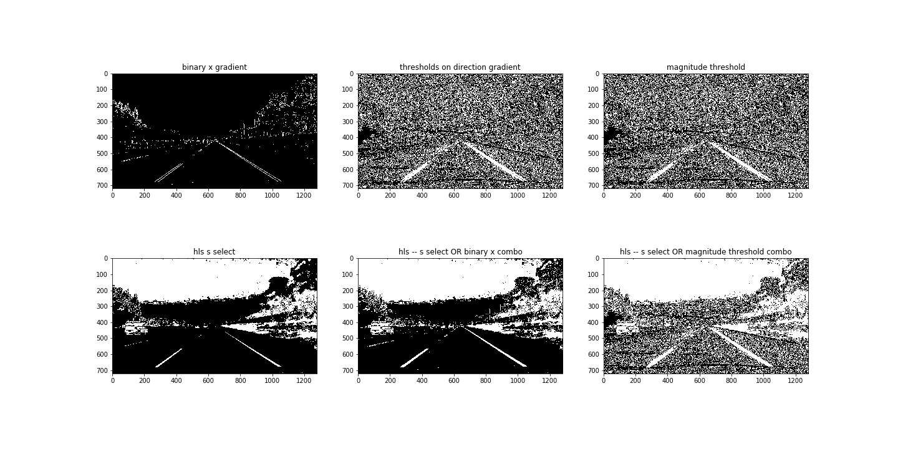
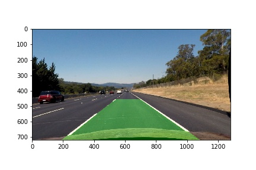
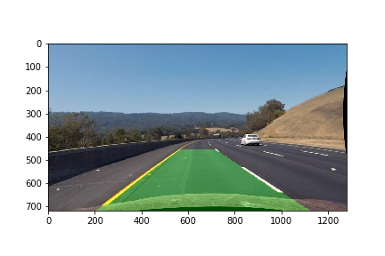
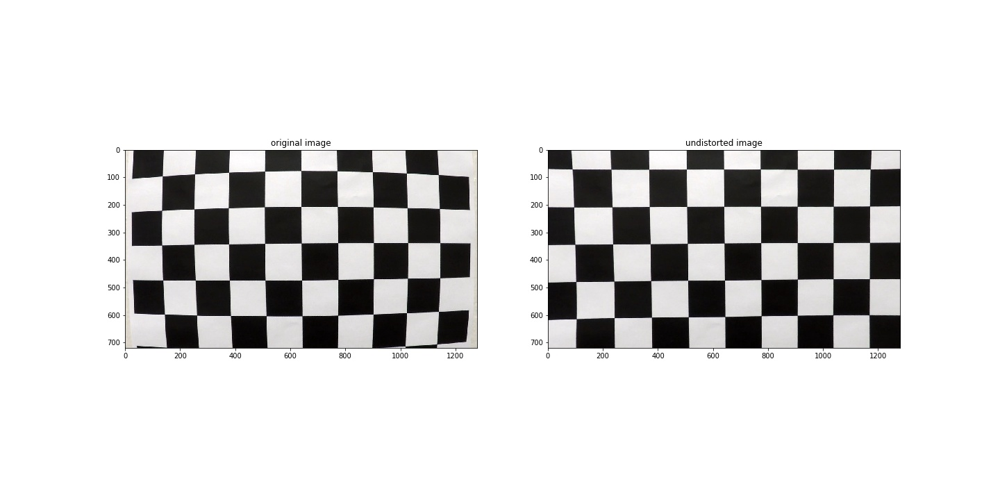
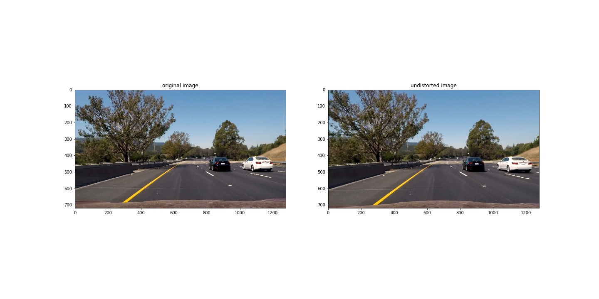
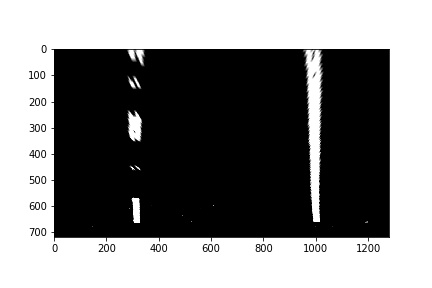
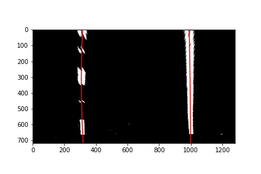
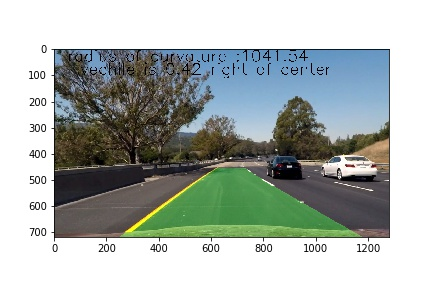

## Writeup 

---

**Advanced Lane Finding Project**

The goals / steps of this project are the following:

* Compute the camera calibration matrix and distortion coefficients given a set of chessboard images.
* Apply a distortion correction to raw images.
* Use color transforms, gradients, etc., to create a thresholded binary image.
* Apply a perspective transform to rectify binary image ("birds-eye view").
* Detect lane pixels and fit to find the lane boundary.
* Determine the curvature of the lane and vehicle position with respect to center.
* Warp the detected lane boundaries back onto the original image.
* Output visual display of the lane boundaries and numerical estimation of lane curvature and vehicle position.




other test_images are in /output_images/ folder

## [Rubric](https://review.udacity.com/#!/rubrics/571/view) Points

### Here I will consider the rubric points individually and describe how I addressed each point in my implementation.  

--- 
Note : all the code is present in single file 'Advanced Lane Finding.ipynb'

### Camera Calibration

#### 1. Briefly state how you computed the camera matrix and distortion coefficients. Provide an example of a distortion corrected calibration image.

The code for this step is contained in the second and third code cell of the IPython notebook located in "/Advanced\ Lane\ Finding.ipynb".  

I start by preparing "object points", which will be the (x, y, z) coordinates of the chessboard corners in the world. Here I am assuming the chessboard is fixed on the (x, y) plane at z=0, such that the object points are the same for each calibration image.  Thus, `objp` is just a replicated array of coordinates, and `objpoints` will be appended with a copy of it every time I successfully detect all chessboard corners in a test image.  `imgpoints` will be appended with the (x, y) pixel position of each of the corners in the image plane with each successful chessboard detection.  

I then used the output `objpoints` and `imgpoints` to compute the camera calibration and distortion coefficients using the `cv2.calibrateCamera()` function.  I applied this distortion correction to the test image using the `cv2.undistort()` function and obtained this result: 



### Pipeline (single images)

#### 1. Provide an example of a distortion-corrected image.

To demonstrate this step, I will describe how I apply the distortion correction to one of the test images like this one:


#### 2. Describe how (and identify where in your code) you used color transforms, gradients or other methods to create a thresholded binary image.  Provide an example of a binary image result.

I used a combination of color and gradient thresholds to generate a binary image.  Here's an example of my output for this step.  (note: this is not actually from one of the test images)


#### 3. Describe how (and identify where in your code) you performed a perspective transform and provide an example of a transformed image.

The code for my perspective transform includes a function called `perspective_transform()`, which appears in cell 5 .  The `perspective_transform()` function takes as inputs an image (`img`).I chose the hardcode the source and destination points by analysing images through eye !:

```python
src = np.float32(
                    [
                        [447,550],
                        [300,650],
                        [874,550],
                        [1050,650]
                    ]
                    )
    dst = np.float32(
                    [
                        [300,550],
                        [300,650],
                        [1050,550],
                        [1050,650]
                    ]
                    )
```

This resulted in the following source and destination points:

| Source        | Destination   | 
|:-------------:|:-------------:| 
| 447, 550      | 300, 550        | 
| 300, 650      | 300, 650      |
| 874, 550     | 1050, 550      |
| 1050, 650      | 1050, 650        |

I verified that my perspective transform was working as expected by drawing the `src` and `dst` points onto a test image and its warped counterpart to verify that the lines appear parallel in the warped image.



#### 4. Describe how (and identify where in your code) you identified lane-line pixels and fit their positions with a polynomial?

I identified lane pixels using sliding window approach and the code related to this is in cells 6,7. then i got results as expected, below is attached image of lane pixels identified by sliding window algo.



#### 5. Describe how (and identify where in your code) you calculated the radius of curvature of the lane and the position of the vehicle with respect to center.

I did this in the cell 8, I employed the formula of Rc = (1+(2*A+B)^2)^(1.5)/|2*A| and scaled pixels to meters so that we can get radius of curvature in distance metric.
#### 6. Provide an example image of your result plotted back down onto the road such that the lane area is identified clearly.

I implemented this step in cell 9 in my code in the function `pipeline()`.  Here is an example of my result on a test image:



---

### Pipeline (video)

#### 1. Provide a link to your final video output.  Your pipeline should perform reasonably well on the entire project video (wobbly lines are ok but no catastrophic failures that would cause the car to drive off the road!).

Here's a [link to my video result](./project_video_output.mp4)

---

### Discussion

#### 1. Briefly discuss any problems / issues you faced in your implementation of this project.  Where will your pipeline likely fail?  What could you do to make it more robust?

in building this pipeline we assumed that camera is fixed on top, if this does not hold then perspective transform of image fails and gets unexpected results.
Similary of there is vibration in vehicle while moving becaue of bumps on road then it might lead to fluctuation of lane segments detected.
